## Python and Django for Beginners course's   Djago part

# certificate 


### [Udemy Course Python and Django for Beginners link](https://www.udemy.com/course/python-tutorials-for-by-navinreddy)


## Screenshot

### Travello Web View 
  

  

  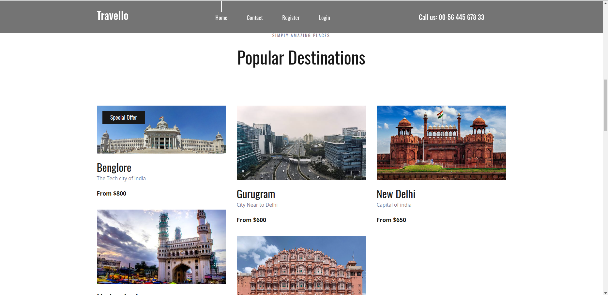

  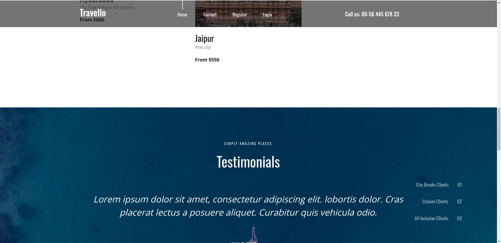

  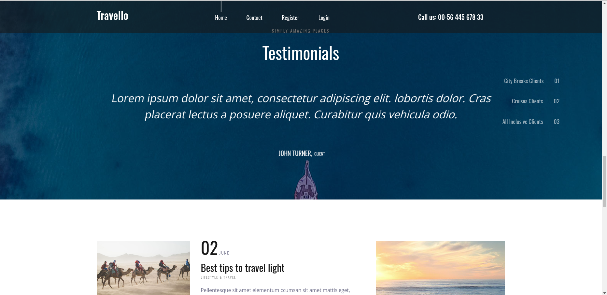

  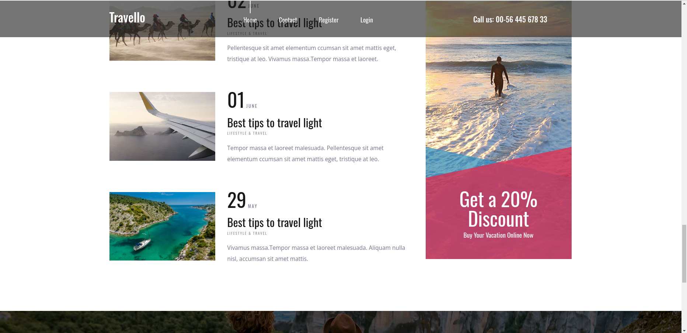

  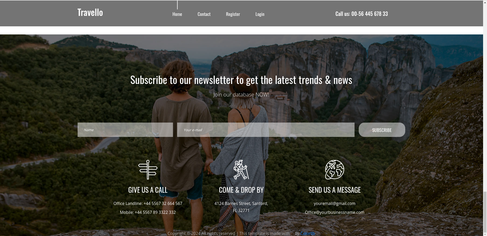

### Register a New user
  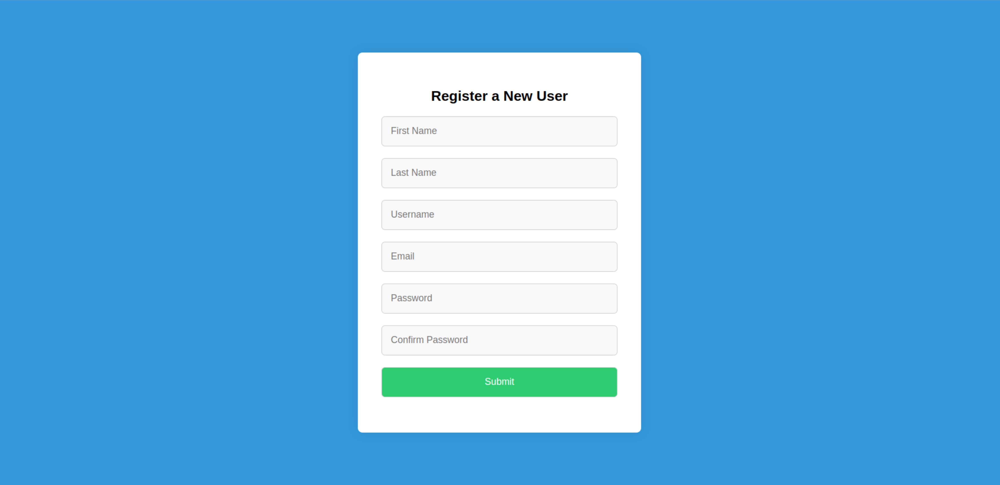

### Login Page 
  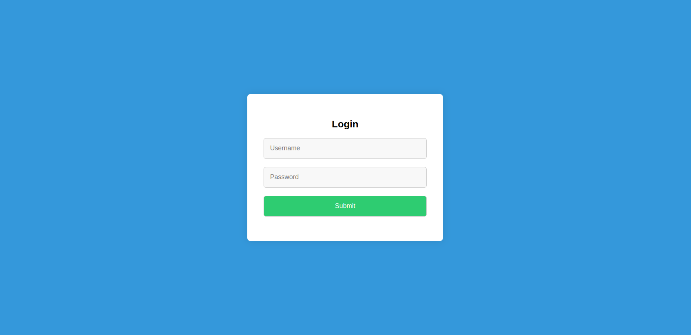

### Home Page After Login
  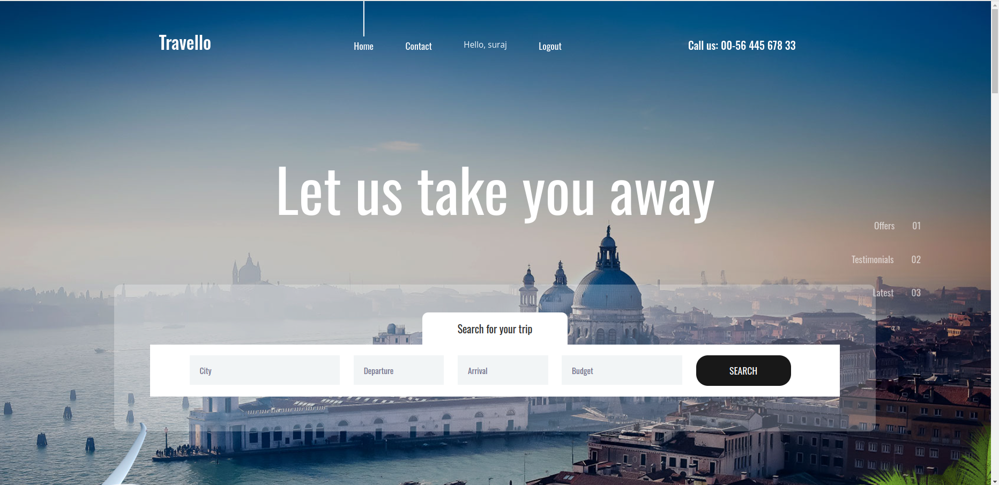

### Admin panel home
  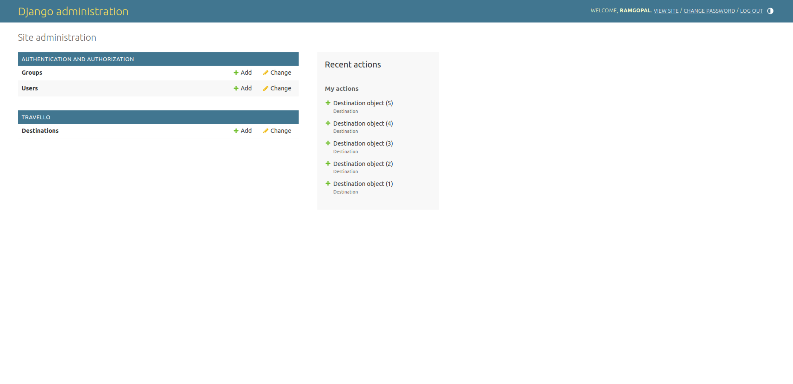

### Admin/user
  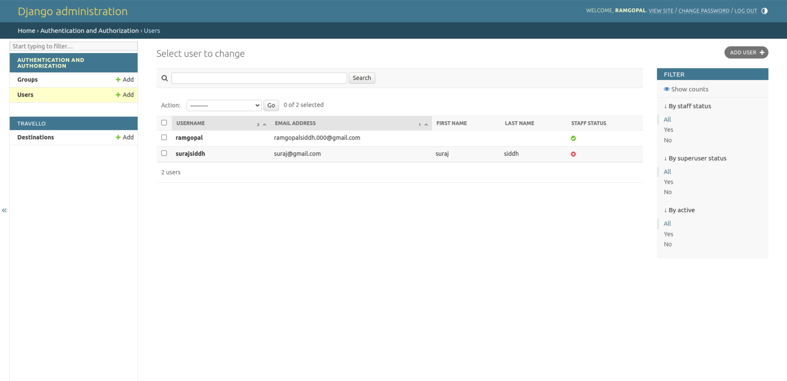

### Admin/Destinations
  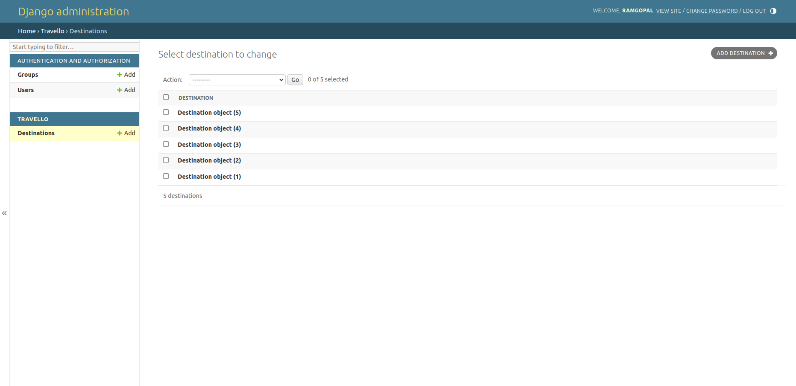


### Setup and run locally
```shell
# Create virtual env 
virtualenv venv
# Give proper permission to activate file
chmod u+x activate
# Activate Virtual env
source venv/bin/activate
# deactivate Virtual env :- 
deactivate

```

### Install django
#### Run : `pip install django`

### Create project and app and start server

```shell
# Create new project  :-  
django-admin startproject <telusko(project name)>
#Go into project :-   
cd telusko
#Run server :-  
python manage.py runserver
#Stop server by press 
ctrl+C

# Then 

# Create a new App :- 
python manage.py startapp <calc(App name)>

```
#### Log in psql  user  `sudo -u postgres psql`

### Run static files(style and javascripts)
```shell

# go in this location:-  
django-course/assets
# and run on 5000 port localhost
python3 -m http.server 5000

```
#### Acess Admin panel
```shell
# go to url(localhost:8000/admin) :-  
"http://127.0.0.1:8000/admin/"
```

##### for more info OR suggestion contact me on

 ### <a href="https://twitter.com/ramgopalsiddh1/"> my twitter </a>

 ### 🔗<a href="https://ramgopal.dev/">portfolio website</a>
